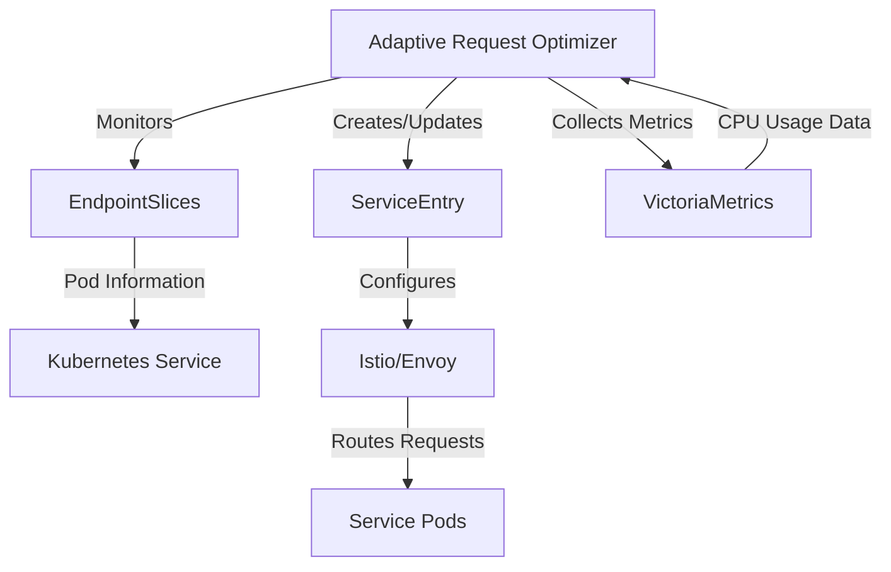

# Istio Adaptive Least Request Optimizer

A Kubernetes operator that optimizes tail latency in heterogeneous environments by dynamically adjusting Istio's load balancing weights based on real-time CPU metrics.

## Overview

The Istio Adaptive Least Request Optimizer addresses a critical challenge in heterogeneous Kubernetes environments where pods run on different types of hardware (e.g., different CPU architectures or cloud instance types). In such environments, traditional load balancing strategies can lead to suboptimal performance and increased tail latency.

This operator:
- Dynamically adjusts Envoy's load balancing weights based on real-time CPU metrics
- Integrates seamlessly with Istio's ServiceEntry Custom Resource Definition (CRD)
- Automatically optimizes request distribution across heterogeneous hardware
- Reduces tail latency in mixed-hardware environments

### Key Benefits

- **Reduced Tail Latency**: Automatically adjusts request distribution based on actual CPU performance
- **Hardware-Aware Routing**: Optimizes for heterogeneous environments with different CPU capabilities
- **Zero Application Changes**: Works with existing Istio-enabled services without code modifications
- **Dynamic Adaptation**: Continuously updates weights based on real-time metrics
- **Kubernetes Native**: Follows operator pattern and integrates with existing Kubernetes tooling

## Architecture



## Prerequisites

- Kubernetes v1.22+
- Istio v1.10+
- VictoriaMetrics v1.63.0+
- kubectl v1.22+

## Installation

There are several ways to install the operator:

### Local Development Installation

1. Build and install the operator:
```bash
# Build the operator binary
make build

# Install CRDs into the cluster
make install

# Deploy the controller in the cluster
make deploy IMG=<your-registry>/istio-adaptive-least-request:tag
```

### Production Installation

1. Build and push a multi-architecture container image:
```bash
# Build and push multi-arch images (amd64, arm64, s390x, ppc64le)
make docker-buildx IMG=<your-registry>/istio-adaptive-least-request:tag
```

2. Generate and apply the installation manifest:
```bash
# Generate the installation YAML
make build-installer IMG=<your-registry>/istio-adaptive-least-request:tag

# Apply the generated manifest
kubectl apply -f dist/install.yaml
```

### Uninstall

To remove the operator from your cluster:
```bash
# Remove the controller
make undeploy

# Remove CRDs and associated resources
make uninstall
```

Note: Replace `<your-registry>` with your container registry (e.g., docker.io/username).

## Usage

1. Create an IstioAdaptiveRequestOptimizer resource for your service:

```yaml
apiVersion: optimization.liorfranko.github.io/v1alpha1
kind: IstioAdaptiveRequestOptimizer
metadata:
  name: myapp-optimizer
spec:
  service_name: myapp-service      # The service to optimize
  service_namespace: default       # Namespace of the service
  locality_enabled: true          # Enable zone-aware routing
  service_ports:                  # Ports to optimize (optional)
    - number: 8080
      protocol: http
    - number: 9090
      protocol: grpc
```

2. The operator will:
   - Monitor the service's endpoints
   - Create/update ServiceEntry resources
   - Configure weight-based load balancing
   - Dynamically adjust weights based on CPU metrics

## Configuration Options

| Parameter | Description | Default |
|-----------|-------------|---------|
| `service_name` | Name of the service to optimize | Required |
| `service_namespace` | Namespace of the service | Current namespace |
| `locality_enabled` | Enable zone-aware routing | `false` |
| `service_ports` | List of ports to optimize | All ports |

### Service Ports Configuration

```yaml
service_ports:
  - number: 8080        # Port number
    protocol: http      # Protocol (http/grpc)
    targetPort: 8081    # Target port (optional)
```

## Best Practices

### Load Balancing Algorithm

While Istio 1.14+ defaults to LEAST_REQUEST over ROUND_ROBIN, when using this operator, it's recommended to use ROUND_ROBIN load balancing. Here's why:

- This controller specifically optimizes request distribution through dynamic weight adjustments
- ROUND_ROBIN with weighted load balancing provides more predictable and controllable request distribution
- The controller's weight calculations are designed to work optimally with ROUND_ROBIN's deterministic behavior
- Using LEAST_REQUEST alongside dynamic weights might result in less precise load distribution

To configure ROUND_ROBIN in your Istio destination rules:

```yaml
apiVersion: networking.istio.io/v1alpha3
kind: DestinationRule
metadata:
  name: my-service-destination
spec:
  host: my-service
  trafficPolicy:
    loadBalancer:
      simple: ROUND_ROBIN
```

Note: While LEAST_REQUEST is generally superior for static configurations, the dynamic weight adjustments made by this controller work best with ROUND_ROBIN's predictable distribution pattern.

### Important Limitations

- **Istio Dependency**: The controller's weight-based routing adjustments only work for traffic sources that have Istio sidecar injection enabled. Traffic from sources without Istio sidecars will be unaware of the routing weights and will not respect the optimized distribution patterns.

- **DestinationRule Configuration**: When using this operator, proper DestinationRule configuration is crucial, especially for cross-namespace traffic. The resolution of routing rules follows Istio's hierarchical namespace context. Key considerations:

  ```yaml
  apiVersion: networking.istio.io/v1alpha3
  kind: DestinationRule
  metadata:
    name: my-service-destination
  spec:
    host: my-service
    exportTo:
      - "*"      # Export globally to all namespaces
      # - "."    # Export only to the same namespace
      # - "ns1"  # Export to specific namespace(s)
    trafficPolicy:
      loadBalancer:
        simple: ROUND_ROBIN
  ```

  The `exportTo` field controls the visibility of routing rules:
  - Default (if not specified): Exports to all namespaces
  - `"."`: Restricts to the same namespace as the DestinationRule
  - `"*"`: Exports globally to all namespaces
  - List of namespaces: Controls specific namespace visibility

  Without proper `exportTo` configuration, services in other namespaces may not respect the optimized routing weights, leading to unexpected traffic distribution patterns.

## Monitoring

The operator exports Prometheus metrics for monitoring. Access metrics at: `http://operator-service:8080/metrics`

### Custom Metrics

| Metric Name | Type | Description | Labels |
|-------------|------|-------------|--------|
| `endpoint_weight` | Gauge | Weight of a service entry endpoint | `service_namespace`, `service_name`, `pod_ip`, `locality` |
| `reconciler_errors` | Counter | Counts of various errors that occur within the reconciler | `controller`, `type`, `name`, `namespace` |
| `query_latency` | Gauge | Time to get response from VictoriaMetrics for a service in seconds | `service_name`, `service_namespace` |

### Controller Runtime Metrics

The operator also exposes the standard controller-runtime metrics:

| Metric Name | Type | Description |
|-------------|------|-------------|
| `controller_runtime_reconcile_total` | Counter | Total number of reconciliations per controller |
| `controller_runtime_reconcile_errors_total` | Counter | Total number of reconciliation errors per controller |
| `controller_runtime_reconcile_time_seconds` | Histogram | Length of time per reconciliation per controller |
| `controller_runtime_max_concurrent_reconciles` | Gauge | Maximum number of concurrent reconciles per controller |
| `workqueue_adds_total` | Counter | Total number of adds to workqueue |
| `workqueue_depth` | Gauge | Current depth of workqueue |
| `workqueue_longest_running_processor_seconds` | Gauge | Length of time the longest running processor has been running |
| `workqueue_queue_duration_seconds` | Histogram | Time spent by items waiting in the workqueue |
| `workqueue_retries_total` | Counter | Total number of retries handled by workqueue |
| `workqueue_unfinished_work_seconds` | Gauge | Time spent by all current unfinished work items |

These metrics help monitor:
- Controller performance and health
- Reconciliation success rates and latencies
- Work queue performance
- Error rates and types
- Resource utilization patterns

## Real-World Performance

Based on production deployments, the operator has demonstrated:
- 30-50% reduction in p99 latency
- Improved resource utilization across heterogeneous hardware
- Stable performance during traffic spikes

## Contributing

Contributions are welcome! Here's how you can help:

1. Fork the repository
2. Create a feature branch
3. Make your changes
4. Submit a pull request

Please ensure:
- Tests pass (`make test`)
- Code follows Go standards
- Documentation is updated
- Commit messages are clear

## Future Enhancements

- [ ] Support for custom metrics beyond CPU
- [ ] Enhanced locality-based routing
- [ ] Integration with additional metrics providers
- [ ] Advanced weight calculation algorithms
- [ ] Multi-cluster support

## License

Copyright 2024.

Licensed under the Apache License, Version 2.0 (the "License");
you may not use this file except in compliance with the License.
You may obtain a copy of the License at

    http://www.apache.org/licenses/LICENSE-2.0

Unless required by applicable law or agreed to in writing, software
distributed under the License is distributed on an "AS IS" BASIS,
WITHOUT WARRANTIES OR CONDITIONS OF ANY KIND, either express or implied.
See the License for the specific language governing permissions and
limitations under the License.
